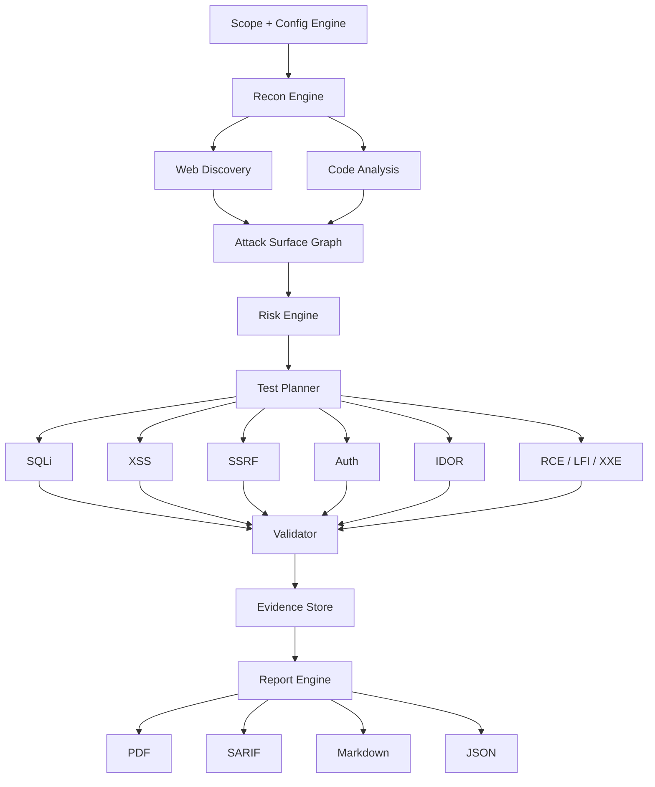

# 𝓝𝓸𝓬𝓽𝓲𝓼

**An autonomous AI pentester that finds real vulnerabilities, proves them with working exploits, and writes the report for you.**

[](https://www.python.org/)
[](https://github.com/astral-sh/uv)
[](https://typer.tiangolo.com/)
[](#where%20it%20stands)
[](LICENSE)
[](#responsible%20use)

## What it does

Point Noctis at a target URL (and optionally its source code), and it works through a full pentest pipeline on its own: it spiders the app, fingerprints the stack, traces user input to dangerous sinks in the code, builds a graph of the entire attack surface, and (in later phases) prioritizes and launches real exploitation agents against it. Every finding has to survive a replay before it gets reported, so what comes out the other end is a client ready report backed by proof, not a list of guesses from a scanner.

It runs locally on your own machine, talks to whichever AI provider you configure (Gemini, OpenAI, Claude, or OpenRouter), and is meant to hold up under real professional engagements as well as CTF competitions.

## How it works



Everything an agent thinks or decides runs through a single model router, so swapping providers never means touching agent code.

## Getting started

```bash
uv sync
uv run playwright install chromium
```

Then create a `.env` file in the project root with at least one model API key set:

```env
GEMINI_API_KEY=your_gemini_key_here
OPENAI_API_KEY=your_openai_key_here
ANTHROPIC_API_KEY=your_anthropic_key_here
OPENROUTER_API_KEY=your_openrouter_key_here

DEFAULT_MODEL=gemini
MAX_WORKERS=3
REQUESTS_PER_SECOND=10
MAX_SCAN_DEPTH=5
CONFIRM_DESTRUCTIVE=true
REPORT_OUTPUT_DIR=./reports
WORKSPACE_DIR=./workspaces
```

## Usage

```bash
# Start a scan (spiders the target, optionally analyzes local source)
uv run noctis scan --url https://example.com --repo /path/to/code

# Preview what a scan would do without sending a single request
uv run noctis scan --url https://example.com --dry-run

# List past scan sessions
uv run noctis workspaces list

# Resume an interrupted scan
uv run noctis resume --workspace <id>

# Dump raw findings for a workspace
uv run noctis report --workspace <id> --format json
```

Noctis is built as a triage tool you work with, not something you point and
walk away from. A plain `scan` stops right after the prioritized exploitation
queue is printed so you can review it; nothing gets attacked until you say so:

```bash
# Review the queue only -- no exploitation happens yet
uv run noctis scan --url https://example.com --repo /path/to/code

# Launch exploitation agents against that queue once you've reviewed it
uv run noctis resume --workspace <id> --exploit

# Or do both in one shot (still prompts for confirmation unless --yes)
uv run noctis scan --url https://example.com --repo /path/to/code --exploit
```

## Where it stands

| Piece | State |
|---|---|
| CLI + Rich TUI | Done |
| Model router (Gemini / OpenAI / Claude / OpenRouter) | Done |
| Scope engine, enforced on every request | Done |
| SQLite workspace manager with resume | Done |
| Web discovery (spider, fingerprinting, JS route extraction) | Done |
| Static code analysis (routes, sinks, secrets) | Done |
| NetworkX attack surface graph | Done |
| Risk engine (exploitability x impact scoring, attack chain detection) | Done |
| Test planner (prioritized exploitation queue) + concurrency manager | Done |
| Exploit agent base class | Done |
| Exploitation agents (SQLi, XSS, SSRF, Auth, IDOR, RCE, LFI, XXE, credential exposure) | Done |
| Validator + evidence store | Planned |
| Report engine (PDF / SARIF / Markdown / JSON) | Planned |
| FastAPI backend + React dashboard | Planned |

`noctis scan` runs every stage that exists today and stops cleanly once it reaches one that doesn't, rather than pretending to finish. The exploitation stage additionally never fires without an explicit `--exploit` flag (and a confirmation prompt, unless `CONFIRM_DESTRUCTIVE=false` or `--yes`) -- Noctis is meant to be a triage tool you operate, not something that attacks a target on its own.

Every agent only reports `found=true` after its own immediate re-check reproduces the result, and defaults to safe, non-destructive confirmation techniques (blind/time-based detection, benign canaries, reading a known-harmless file) rather than full exploitation. Heavier techniques -- an actual sqlmap data-extraction pass, default-credential guessing -- stay behind `CONFIRM_DESTRUCTIVE=false` in `.env`.

## Responsible use

Noctis is built to run real exploits. Only ever point it at targets you own or are explicitly authorized to test, and respect the scope you configure. This project isn't intended for, and shouldn't be used for, unauthorized access to systems you don't control.
